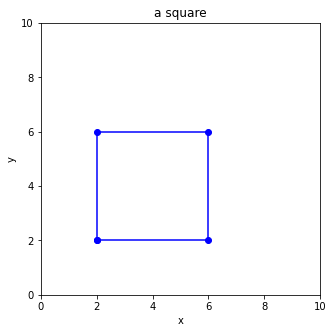

# Problem Set 18
**Date（日期）**:____________________   **Name（姓名）**:___________________________

(1) What is the final output?  （最后输出是什么？）

```python
numbers = [1,0,2,0,3,0]
i = 0
while i<3:
    print(numbers[i])
    i += 1
```

(2) What is the final output?  （最后输出是什么？）

```python
numbers = [1,4,9,16,25]
i = 0
while i<len(numbers):
    print(numbers[i])
    i += 1
    if i>3:
        break
```

(3) What is the final output?  （最后输出是什么？）
```python
a = 4
b = 5
print(a==3)
print(b==5)
print(a>3)
print(a>4)
print(b>4)
print(b>5)
print("logical operators and/or:")
print(a>3 and b>4)
print(a>3 and b>5)
print(a>3 or b>4)
print(a>4 or b>5)
print(a>3 and b>4 and a+b>9)

```

(4) What is the final output?  （最后输出是什么？）
```python
persons = ["Muzzy","Bob", "Sylvia", "Corvax"]
i = 0
while i<len(persons):
    if i>1 and i<4:
        print(persons[i])
    i = i + 1
```

(5) What is the final output?  （最后输出是什么？）
```python
x = 5
if x>3 and x<6:
  print("ok")
else:
  print("not ok")
```

(6) What is the final output?  （最后输出是什么？）
```python
numbers = [1, 7, 5, 3, 8, 9]
i = 0
for i in range(len(numbers)):
    if numbers[i] < 4:
        print(numbers[i])
```

(7) What is the final output?  （最后输出是什么？）
```python
x = 5
if x>8 or x<6:
  print("ok")
else:
  print("not ok")
```

(8) Fill in the missing code  （补充缺失的代码）
```python
from matplotlib import pyplot as plt
plt.figure(figsize=(5,5))
plt.xlim(0,10)
plt.ylim(0,10)
plt.xlabel("x")
plt.ylabel("y")
plt.title('a square')

x = [               ]
y = [               ]

plt.plot(x,y,'bo-')
plt.show()
```


