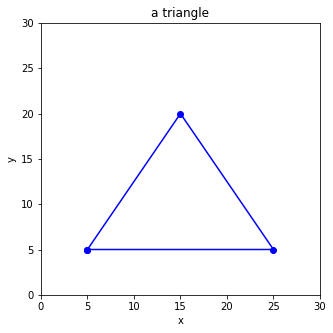

# Problem Set 20-3
**Date（日期）**:____________________   **Name（姓名）**:___________________________

(1) What is the final output?  （最后输出是什么？）

```python
numbers = [2,3,5,7,9,11,13,19]
i = 0
while i<5:
    print(numbers[i])
    i += 1
```

(2) What is the final output?  （最后输出是什么？）

```python
numbers = [1,2,4,8,16,32,64]
i = 0
while i<len(numbers):
    print(numbers[i])
    i += 1
    if i>3:
        break
```

(3) What is the final output?  （最后输出是什么？）
```python
a = 32 + 27 - 53
b = 128 + 256 - 379
print(a>5 and b>4)
print(a>6 and b>5)
print(a>5 or b>5)
print(a>6 or b>4)
print(a>5 and b>4 and a+b>10)

```

(4) What is the final output?  （最后输出是什么？）
```python
persons = ["Muzzy","Bob", "Sylvia", "Corvax", "King"]
i = 0
while i<len(persons):
    if i<2 or i>3:
        print(persons[i])
    i = i + 1
```

(5) What is the final output?  （最后输出是什么？）
```python
x = 328 + 159 - 477
if x>12 and x<13:
  print("ok")
else:
  print("not ok")
```

(6) What is the final output?  （最后输出是什么？）
```python
numbers = [956, 689, 543, 999, 511]
i = 0
for i in range(len(numbers)):
    if numbers[i] > 256*2 - 17:
        print(numbers[i])
```

(7) What is the final output?  （最后输出是什么？）
```python
x = 38 + 29 - 56
if x>12 or x<11:
  print("ok")
else:
  print("not ok")
```

(8) Fill in the missing code  （补充缺失的代码）
```python
_______ matplotlib _________ pyplot as _______
plt._______(figsize=(5,5))
plt._______(0,_____)
plt._______(0,_____)
plt._______("_____")
plt._______("_____")
plt._______('a triangle')

x = [_______________]
____ = [_______________]

____._______(____,y,'_______')
plt._______()
```



