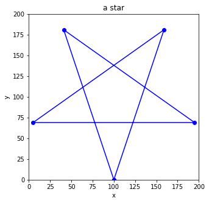

# Problem Set 20
**Date（日期）**:____________________   **Name（姓名）**:___________________________

(1) What is the final output?  （最后输出是什么？）

```python
numbers = [7,6,2,3,5,9]
i = 0
while i<3:
    print(numbers[i])
    i += 1
```

(2) What is the final output?  （最后输出是什么？）

```python
numbers = [12,3,6,9,15]
i = 0
while i<len(numbers):
    print(numbers[i])
    i += 1
    if i>2:
        break
```

(3) What is the final output?  （最后输出是什么？）
```python
a = 12-6
b = 4
print(a>3 and b>4)
print(a>3 and b>5)
print(a>3 or b>4)
print(a>4 or b>5)
print(a>3 and b>4 and a+b>8)

```

(4) What is the final output?  （最后输出是什么？）
```python
persons = ["Muzzy","Bob", "Sylvia", "Corvax"]
i = 0
while i<len(persons):
    if i>1 and i<4:
        print(persons[i])
    i = i + 1
```

(5) What is the final output?  （最后输出是什么？）
```python
x = 15
if x>10 and x<16:
  print("ok")
else:
  print("not ok")
```

(6) What is the final output?  （最后输出是什么？）
```python
numbers = [12, 3, 5, 17, 9, 21]
i = 0
for i in range(len(numbers)):
    if numbers[i] > 15:
        print(numbers[i])
```

(7) What is the final output?  （最后输出是什么？）
```python
x = 9
if x>8 or x<6:
  print("ok")
else:
  print("not ok")
```

(8) Fill in the missing code  （补充缺失的代码）
```python
from matplotlib import pyplot as _______
plt.figure(figsize=(5,5))
plt.xlim(0,10)
plt.ylim(0,____)
plt.xlabel("x")
plt.ylabel("___")
plt.title('a triangle')

x = [_______________]
y = [_______________]

plt.plot(x,y,'bo-')
plt.show()
```


(9) Fill in the missing code  （补充缺失的代码）
```python
from matplotlib import pyplot as _______
plt.figure(figsize=(5,5))
plt._______(0,200)
plt._______(0,200)
plt._________("x")
plt._________("y")
plt._________('a star')

x = [100,159,5,195,41,100]
y = [0,181,69,69,181,0]
plt.________(x,y,'________')
plt.__________()
```

