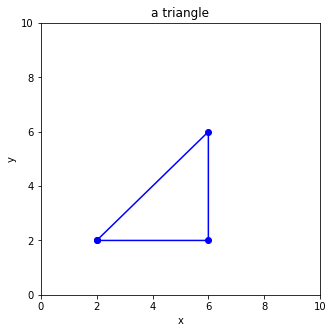

# Problem Set 21-2
**Date（日期）**:____________________   **Name（姓名）**:___________________________

(1) What is the final output?  （最后输出是什么？）

```python
numbers = [1, 2, 4, 8, 16, 32]
i = 0
while i<4:
    print(numbers[i])
    i += 1
```

(2) What is the final output?  （最后输出是什么？）

```python
numbers = [1, 2, 4, 8, 16, 32]
i = 0
while i<len(numbers):
    print(numbers[i])
    i += 1
    if i>4:
        break
```

(3) Fill in the corresponding decimal number in the underlines. (二进制转十进制，请填写对应的十进制数)  

| binary 二进制  | decimal 十进制  | binary 二进制  | decimal 十进制  |
|---|---|---|---|
|**1001** |  |**1011** |  |  
|**1101** |  |**0111** |  |  
|**1111** |  |**0010** |  |  

(4) Recap, power of 2（复习，2的幂）

| 2的幂    |   结果        |
|------|------|
| $2^0$ |      |
| $2^3$   |     |
| $2^5$ |      |

(5) Compute the sum （求和，注意先计算2的幂，再相加）  
$2^4 + 6 - 4\times 4 - (1 + 4)$

(6) What is the final output?  （最后输出是什么？）
```python
c = len("Hello,Muzzy") - 6
if c >5:
  print(">5")
elif c==5:
  print("=5")
else:
  print("<5")
```

(7) What is the final output?  （最后输出是什么？）
```python
numbers = [1,4,9,16,25,36,49,64,81]
for i in range(4,7):
    print(numbers[i])
```

(8) What is the final output?  （最后输出是什么？）
```python
numbers = [1,4,9,16,25,36,49,64,81]
for i in range(5):
    print(numbers[i])
```

(9) What is the final output?  （最后输出是什么？）
```python
persons = ["Muzzy","Bob", "Sylvia", "Corvax", "King", "Queen"]
i = 0
while i<len(persons):
    if i<2 or i>4:
        print(persons[i])
    i = i + 1
```

(10) What is the final output?  （最后输出是什么？）
```python
x = 168 + 167 - 148 - 147 + 164 + 163 - 144 - 143
if x>70 and x<90:
  print("ok")
else:
  print("not ok")
```

(11) What is the final output?  （最后输出是什么？）
```python
numbers = [133, 88, 238, 99, 211]
i = 0
for i in range(len(numbers)):
    if numbers[i] < 128 + 146 - (118 + 56):
        print(numbers[i])
```

(12) Fill in the missing code  （补充缺失的代码）
```python
_______ matplotlib _________ pyplot as _______
plt._______(figsize=(5,5))
plt._______(0,_____)
plt._______(0,_____)
plt._______("_____")
plt._______("_____")
plt._______('a triangle')

x = [_______________]
____ = [_______________]

____._______(____,y,'_______')
plt._______()
```



