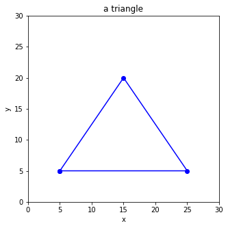

# Problem Set 21-2
**Date（日期）**:____________________   **Name（姓名）**:___________________________

(1) What is the final output?  （最后输出是什么？）

```python
numbers = [1, 2, 4, 8, 16, 32]
i = 0
while i<4:
    print(numbers[i])
    i += 1
```

(2) What is the final output?  （最后输出是什么？）

```python
numbers = [1, 2, 4, 8, 16, 32]
i = 0
while i<len(numbers):
    print(numbers[i])
    i += 1
    if i>4:
        break
```

(3) Recap, power of 2, compute the sum（复习2的幂，求和） 

$2^3\times \textbf{1} + 2^2\times \textbf{1} + 2^1 \times \textbf{1} + 2^0 \times \textbf{0}$     (即二进制"1110"转成10进制)  
$2^3\times \textbf{1} + 2^2\times \textbf{0} + 2^1 \times \textbf{1} + 2^0 \times \textbf{1}$     (即二进制"1011"转成10进制) 

(4) Fill in the corresponding decimal number in the underlines. (二进制转十进制，请填写对应的十进制数)  

| binary 二进制  | decimal 十进制  | binary 二进制  | decimal 十进制  |
|---|---|---|---|
|**1001** |  |**1000** |  |  
|**1101** |  |**0111** |  |  
|**1111** |  |**0010** |  |  

(5) Recap, power of 2（复习，2的幂）

| 2的幂    |   结果        |
|------|------|
| $2^0$ |      |
| $2^1$ |     |
| $2^2$ |      |
| $2^3$ |     |
| $2^4$ |      |

(6) Compute the sum （求和，注意先计算2的幂，再相加）  
$2^5 + 8 - 5\times 4 - (11 + 4)$

(7) What is the final output?  （最后输出是什么？）
```python
c = len("Hello,Sylvia") - 6
if c >5:
  print(">5")
elif c==5:
  print("=5")
else:
  print("<5")
```

(8) What is the final output?  （最后输出是什么？）
```python
numbers = [1,4,9,16,25,36,49,64,81]
for i in range(3,6):
    print(numbers[i])
```

(9) What is the final output?  （最后输出是什么？）
```python
numbers = [1,4,9,16,25,36,49,64,81]
for i in range(4):
    print(numbers[i])
```

(10) What is the final output?  （最后输出是什么？）
```python
persons = ["Muzzy","Bob", "Sylvia", "Corvax", "King", "Queen"]
i = 0
while i<len(persons):
    if i<2 or i>4:
        print(persons[i])
    i = i + 1
```

(11) What is the final output?  （最后输出是什么？）
```python
x = 129 - (75 + 29) + 233 - (25 + 133)
if x>90 and x<110:
  print("ok")
else:
  print("not ok")
```

(12) What is the final output?  （最后输出是什么？）
```python
numbers = [133, 88, 138, 99, 111]
i = 0
for i in range(len(numbers)):
    if numbers[i] > 138 + 166 - (118 + 56):
        print(numbers[i])
```

(13) Fill in the missing code  （补充缺失的代码）
```python
_______ matplotlib _________ pyplot as _______
plt._______(figsize=(5,5))
plt._______(0,_____)
plt._______(0,_____)
plt._______("_____")
plt._______("_____")
plt._______('a triangle')

x = [_______________]
____ = [_______________]

____._______(____,y,'_______')
plt._______()
```



