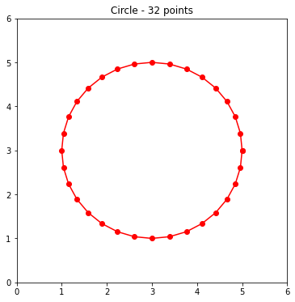

# Problem Set 22-2
**Date（日期）**:____________________   **Name（姓名）**:___________________________

(1) Which of the following divides $[0,12]$ into 3 pieces evenly?  （下面哪条语句将$[0,12]$均分为3段？）

A) linspace(0,12,3)                         B) linspace(0,12,4)

C) linspace(0,3,12)                         D) linspace(0,4,12)


(2) What is the final output?  （最后输出是什么？）

```python
theta = linspace(0,9,4)
print(theta)
```


(3) What is the final output?  （最后输出是什么？）

```python
import numpy as np
x = 3.1415926
k = np.round(x,2)
print(k)
```


(4) Choose the facts about $\pi$. (关于$\pi$的说法哪些是正确的？)  

A) $\pi$是无理数，约等于3.14                       B) $\pi$表示圆周率，等于圆的周长除以直径

C) $\pi$是一个希腊字母                                   D) $\pi$可以用两个整数写成的分数来表示，如$\frac{m}{n}$


(5) What is the final output?  （最后输出是什么？）

```python
import numpy as np
theta = np.linspace(0, 2 * np.pi, 3)
print(np.round(theta,2))
```


(6) What are the steps of drawing a circle or heart?（画圆的步骤是什么？请用1～8标记）

将图形显示出来(plt.show)

设定图像的大小(plt.figure(figsize))

设定要绘制的圆的中心点及圆的半径(center,radius)

设定坐标系的取值范围(xlim, ylim)

画出图形(plt.plot)

将$[0,2\pi]$分割为多个均等的区间(linspace)

根据圆形的坐标公式计算出绘制点的坐标($x=r\cos\theta,y=r\sin\theta$)

设定图像的标题(plt.title)


(6) Fill in the missing code  （补充缺失的代码）

```python
plt.figure(__________=(6,6))
plt.__________(0,6)
plt.__________(0,6)

theta = np.linspace(0, 2 * np.pi, __________)

center = [__________,__________]
radius = __________

x = __________[0] + __________ * np.cos(theta)
y = center[1] + radius * np.sin(theta)

print(f"theta = {np.__________(theta,2)}")
print(f"x = {np.__________(x,2)}")
print(f"y = {np.__________(y,2)}")

__________.title('Circle - 32 points')
plt.__________(x, y,"ro-")
plt.__________()
```

以上代码的输出的图形为：



