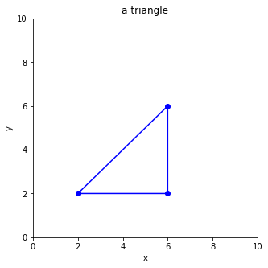
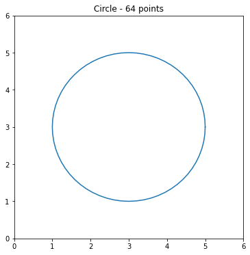

# Problem Set 23-1

**Date（日期）**:__________________   **Name（姓名）**:_____________________   **Score（得分）**:____________________

Problem 6 is 4 points, other problems are 3 points each. Total point is 100. (除第6题外每题3分，第6题4分，满分100)

(1) What is the value of $c$ at last?  （$c$最后的值是多少？）

```python
a = 3
b = a + 7
c = a * b
print(c)
```

(2) What is the value of $c$ at last?  （$c$最后的值是多少？）

```python
a = len("Emmy") - 1
b = 5
c = a * b
print(c)
```

(3) What is the value of $c$ at last?  （$c$最后的值是多少？）

```python
a = 3.14
b = 5
c = a * b
print(c)
```

(4) What is the value of $c$ at last?  （$c$最后的值是多少？）

```python
a = 25 - 7
b = len("zhou")
c = a + b
print(c)
```

(5) Find out all odd numbers  （找出所有的奇数）  

|      |      |      |      |      |
| ---- | ---- | ---- | ---- | ---- |
| 1    | 0    | 5    | 7    | 4    |
| 13   | 28   | 39   | 76   | 52   |
| 234  | 118  | 310  | 64   | 255  |
| 1024 | 128  | 33   | 53   | 1110 |

(6) Have a look at the following table $T$ and answer the questions. (查看下面的表格$并回答问题）

<table>
  <tbody>
    <tr>
      <td>1</td>
      <td>0</td>
      <td>2</td>
      <td>3</td>
      <td>4</td>
    </tr>
    <tr>
      <td>5</td>
      <td>8</td>
      <td>7</td>
      <td>9</td>
      <td>3</td>
    </tr>
    <tr>
      <td>2</td>
      <td>3</td>
      <td>0</td>
      <td>4</td>
      <td>1</td>
    </tr>
  </tbody>
</table>

(6.1) How many rows and columns are there?  （有多少行，多少列？）

(6.2) What is the value of $T[1][4]$?  （$T[1][4]$的值是多少？）

(6.3) Fill in the missing code to print out table $T$（补充缺失的代码，从而打印出上面的表格$T$）

```python
for i in range(_____):
    for j in range(______):
        print(____________, end=" ")
    print("__________")
```

(7）Which are the common components of an IDE? (集成开发环境（IDE）一般有哪些组成部分？请勾选）

<table>
  <tbody>
    <tr>
      <td>Debugging Window 调试窗口</td>
      <td>Output Window 输出窗口</td>
      <td>Console 控制台</td>
    </tr>
    <tr>
      <td>Project Explorer 项目浏览</td>
      <td>File Explorer 文件浏览</td>
      <td>Code Editor 代码编辑器</td>
    </tr>
  </tbody>
</table>

(8）What are the order of the steps of debugging? (标出`调试`步骤的顺序）

<table>
  <tbody>
    <tr>
      <td>Start Debugging 启动调试</td>
      <td>Set Breakpoints 设置断点</td>
      <td>Step Into and Observe 逐行运行并观察变量的值</td>
    </tr>
  </tbody>
</table>

(9）What is the purpose of breakpoints? (设置`断点`的目的是什么？）

(10) What is the final output?  （最后输出是什么？）  

```python
numbers = [1, 2, 4, 8, 16, 32]
i = 0
while i<4:
    print(numbers[i])
    i += 1
```

(11) What is the final output?  （最后输出是什么？）  

```python
numbers = [1, 2, 4, 8, 16, 32]
i = 0
while i<len(numbers):
    print(numbers[i])
    i += 1
    if i>4:
        break
```

(12) Recap, power of 2（复习，2的幂）  

| 2的幂    |   结果        |
|------|------|
| $2^0$   |     |
| $2^1$   |     |
| $2^2$   |     |
| $2^3$ |      |
| $2^4$ |     |

(13) Recap, write down the missing representations（写出缺失的十进制或者二进制表示）  

| binary 二进制    |   decimal 十进制   |
|------|------|
| 11 | 3 |
| 100 |  |
| 101 |  |
|   | 6 |
|  | 7 |

(14) Fill in the corresponding decimal number in the underlines. (二进制转十进制，请填写对应的十进制数)  

| binary 二进制  | decimal 十进制  | binary 二进制  | decimal 十进制  |
|---|---|---|---|
|**1001** |  |**1011** |  |  
|**1101** |  |**0111** |  |  
|**1111** |  |**0010** |  |  

(15) Compute the value （计算）  

$32- (2^0 + 2^1 + 2^2 + 2^3 + 2^4)$

(16) Compute the value （计算）  

$2^4 + 6 - 4\times 4 - (1 + 4)$

(17) What is the final output?  （最后输出是什么？）
```python
c = len("Hello,Muzzy") - 6
if c >5:
  print(">5")
elif c==5:
  print("=5")
else:
  print("<5")
```

(18) What is the final output?  （最后输出是什么？）
```python
numbers = [1,4,9,16,25,36,49,64,81]
for i in range(4,7):
    print(numbers[i])
```

(19) What is the final output?  （最后输出是什么？）
```python
numbers = [1,4,9,16,25,36,49,64,81]
for i in range(5):
    print(numbers[i])
```

(20) What is the final output?  （最后输出是什么？）
```python
persons = ["Muzzy","Bob", "Sylvia", "Corvax", "King", "Queen"]
i = 0
while i<len(persons):
    if i<2 or i>4:
        print(persons[i])
    i = i + 1
```

(21) What is the final output?  （最后输出是什么？）
```python
x = 168 + 167 - 148 - 147 + 164 + 163 - 144 - 143
if x>70 and x<90:
  print("ok")
else:
  print("not ok")
```

(22) Read the following code and answer the questions  （阅读以下代码并回答下面的问题）
```python
for i in range(10):
    for j in range(10):
        print(f"{i}×{j}={i*j}\t",end='')
    print("\n")
```

What's the purpose of "\t" in the above program? (上面程序中的"\t"有什么作用？)  

What's the purpose of "\n" in the above program? (上面程序中的"\n"有什么作用？)

What's the purpose of two for loops in the above program? (两层for循环有什么作用？)

(23) What is the final output?  （最后输出是什么？）
```python
numbers = [133, 88, 238, 99, 211]
i = 0
for i in range(len(numbers)):
    if numbers[i] < 128 + 146 - (118 + 56):
        print(numbers[i])
```

(24) Fill in the missing code  （补充缺失的代码）
```python
_______ matplotlib _________ pyplot as _______
plt._______(figsize=(5,5))
plt._______(0,_____)
plt._______(0,_____)
plt._______("_____")
plt._______("_____")
plt._______('a triangle')

x = [_______________]
____ = [_______________]

____._______(____,y,'_______')
plt._______()
```



(25) Which of the following divides $[0,15]$ into 3 pieces evenly?  （下面哪条语句将$[0,15]$均分为3段？）

A) linspace(0,15,3)                         B) linspace(0,15,4)

C) linspace(0,3,15)                         D) linspace(0,4,15)

(26) What is the final output?  （最后输出是什么？）

```python
theta = linspace(0,12,4)
print(theta)
```

(27) What is the final output?  （最后输出是什么？）

```python
import numpy as np
x = 3.1415926
k = np.round(x,4)
print(k)
```

(28) What is the final output?  （最后输出是什么？）

```python
import numpy as np
theta = np.linspace(0, 2 * np.pi, 3)
print(np.round(theta,3))
```

(29) Fill in the missing code  （补充缺失的代码）

```python
plt.figure(__________=(6,6))
plt.__________(0,6)
plt.__________(0,6)

theta = np.linspace(0, 2 * np.pi, __________)

center = [__________,__________]
radius = __________

x = _________[0] + __________ * np.cos(theta)
y = center[1] + radius * np.sin(theta)

print(f"theta = {np.__________(theta,2)}")
print(f"x = {np.__________(x,2)}")
print(f"y = {np.__________(y,2)}")

__________.title('Circle - 64 points')
plt.__________(______, _____, "_________")
plt.__________()
```

以上代码的输出的图形为：



(30) Which of the following are the input devices of the computer, check the correct ones. (下面哪些是计算机的输入设备,正确的打勾)    
 
|   |   |   |
|---|---|---|
|Keyboard 键盘 | Mouse 鼠标 | Monitor 显示器|
|Touchpad 触摸板 | Microphone 麦克风 | Camera 摄像头|
|Touchscreen 触摸屏 | Printer 打印机 | Scanner 扫描仪|
